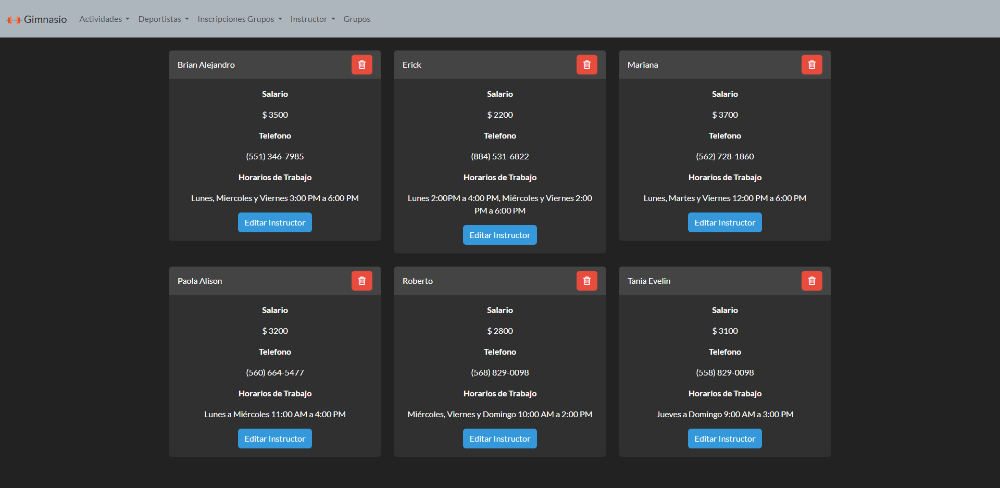

# AcademiaAngular
Código del proyecto “Academia Angular” realizado con Angular, Typescript y NodeJS, el gestor de bases de datos utilizado fue MySQL.

https://user-images.githubusercontent.com/94584093/227757750-880ddbaa-98e9-4eb5-bbab-ce9682502b86.mp4

Esta es una aplicación web básica para administrar grupos de deportes, asi como sus instructores y los estudiantes utilizando tecnologías como Angular, Node, Typescript y MySQL.

### Tecnologias utilizadas: 
- Angular
- Typecript
- NodeJS
- Base de Datos MySQL



### Instalación
```sh
git clone https://github.com/RaulGeronimo/AcademiaAngular.git
cd AcademiaAngular

cd Servidor # Modulos del Servidor
npm i

cd appGimnasio # Modulos de la aplicación
npm i
```

### Ejecución
```sh
cd Servidor # Ejecutar el Servidor
npm run build
npm run dev

cd appGimnasio # Ejecutar la aplicacion
ng serve --open
```

> Necesitas tener la base de datos en el gestor de bases de datos, asi como actualizar la conexion que se encuentra en el archivo `Servidor/data.ts`, la base de datos se encuentra dentro de la carpeta `BD`.
